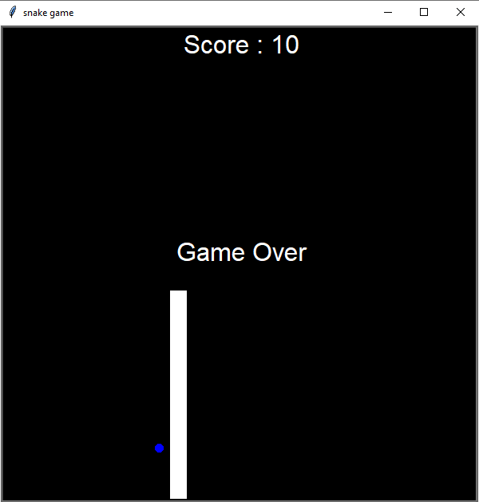

  
 

## About The Project

[game-screenshot]
snake game 
### Built With
[![python][python-pi]][python-url]

## Getting Started

You can just RUN main.py, or you can play the executable file /output/main.exe

<!-- MARKDOWN LINKS & IMAGES -->
[game-screenshot]: images/snake_game.png
[python-pi]:https://img.shields.io/badge/Python-3776AB?style=for-the-badge&logo=python&logoColor=white
[python-url]:https://www.python.org/

